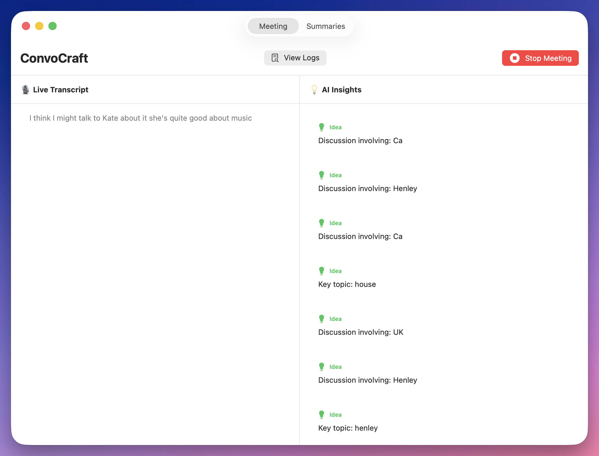

# ConvoCraft

A macOS meeting assistant that provides real-time transcription and AI-driven insights using only Apple frameworks.



> **Note**: This application is designed exclusively for macOS 14.0+ and requires macOS-specific frameworks (SwiftUI, Speech, AVFoundation, ScreenCaptureKit, NaturalLanguage). It will not build on Linux or other platforms.

## Features

### During Meetings (Live)
- 🎙 **Real-time transcription** using Apple's Speech framework
- 💡 **AI-generated insights** including:
  - Clarifying questions
  - Suggested follow-ups
  - Risk detection
  - Key entity tracking
- 🔴 **Live visual indicator** during recording

### After Meetings
- 📝 **Structured summaries** with extractive approach
- ✅ **Action items** automatically extracted
- 🎯 **Key decisions** highlighted
- 💾 **Persistent storage** of transcripts and insights

## Architecture

ConvoCraft is built exclusively with Apple frameworks:

- **ScreenCaptureKit** - Audio capture (system + microphone)
- **Speech** - Real-time transcription
- **NaturalLanguage** - Lightweight NLP for pattern detection
- **SwiftUI** - Modern user interface
- **AVFoundation** - Audio processing
- **Actors** - Concurrency-safe state management

## Requirements

- macOS 14.0 or later
- Microphone permission
- Speech recognition permission
- Screen capture permission (for system audio)

## Building

This is a Swift Package Manager project:

```bash
# Clone and build
swift build
swift run
```

## Privacy & Security

- ✅ **Fully local processing** - No cloud APIs
- ✅ **No network calls** - All AI runs on-device
- ✅ **User-initiated recording** - No background recording
- ✅ **Local storage only** - Transcripts never leave device

## License

MIT License - [LICENSE](LICENSE)
